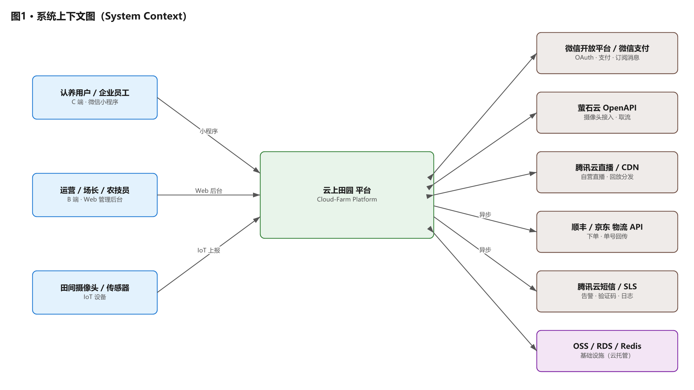
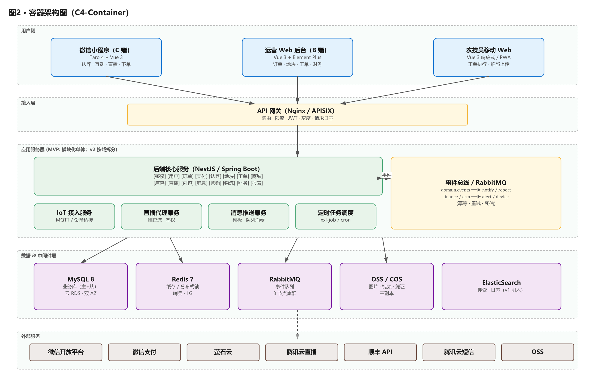
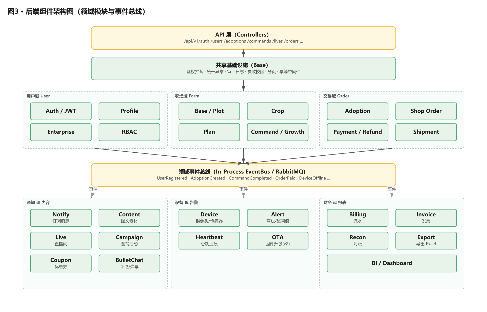
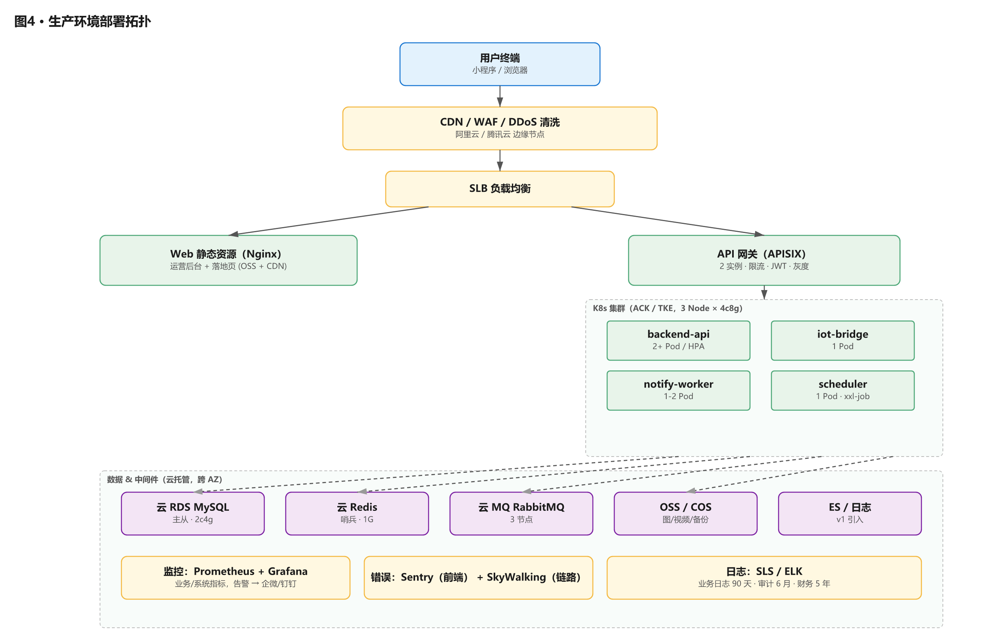
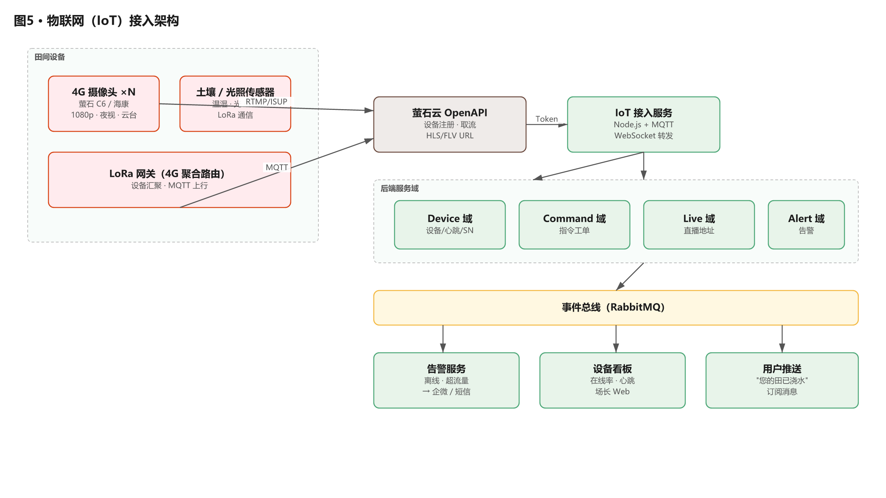
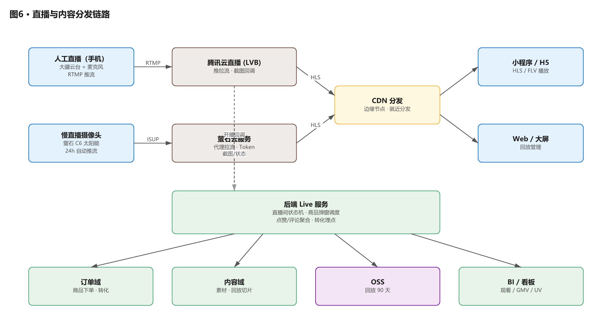
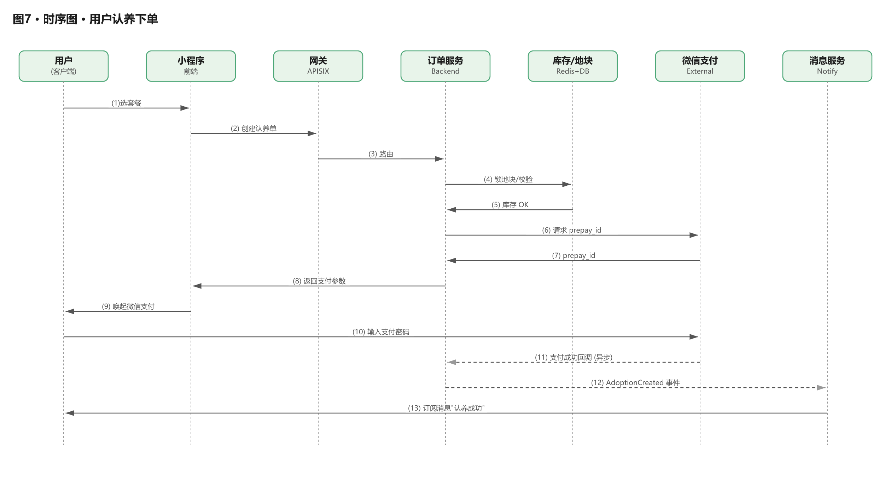
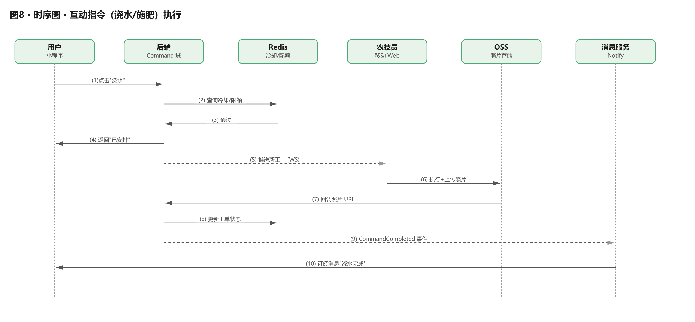

# 云上田园 · 软件架构设计文档（SAD）v1.0

> ⚠️ **本版本已被 [v2](./03_云上田园_软件架构图_v2.md) 取代（2026-04-28）**
>
> v1 → v2 主要变更：
> - C 端从"Taro 双端编译"拆为 **miniapp(Taro) + web(独立 Vue 3)** 两个项目
> - **彻底删除"直播"概念** —— 我们做的是私有摄像头远程监控（1 用户看自己 1 个摄像头），非 1 推流 → N 观众的直播业务
> - 落地 monorepo（pnpm workspace + 4 apps + 3 packages）
> - 后端定型 NestJS + Prisma + MySQL + Redis(可选)
> - 摄像头接入选萤石云 OpenAPI（SaaS，零运维）
> - 移除 v1 的 RabbitMQ / ES / ClickHouse / K8s / 完整可观测性栈（MVP 不需要，过度设计）
>
> 本 v1 文档保留作历史参考，**新决策一律以 v2 为准**。

---

# 以下为 v1 历史内容
> 文档版本：v1.0
> 更新日期：2026-04-19
> 文档类型：软件架构图集 + 设计说明
> 适用范围：MVP 阶段 + v1 扩展，兼顾 v2 演进
> 读者对象：CTO / 技术合伙人、架构师、前后端开发、运维、产品经理

---

## 目录
0. 文档说明与视图约定
1. 系统上下文图（C4-Context）
2. 容器架构图（C4-Container）
3. 后端组件架构图（C4-Component）
4. 前端架构图（小程序 & Web 后台）
5. 数据架构图（ER 概念图 + 数据分层）
6. 部署架构图（生产环境拓扑）
7. 物联网（IoT）接入架构
8. 直播与内容分发链路
9. 消息/事件驱动架构
10. 安全与权限架构
11. 关键业务时序图
12. CI/CD & DevOps 流水线
13. 可观测性架构（日志/监控/告警）
14. 技术选型总览
15. 架构演进路线（MVP → v1 → v2 → v3）
16. 架构决策记录（ADR 摘要）

---

## 0. 文档说明与视图约定

### 0.1 架构视图模型
本文档采用 **"C4 模型 + 4+1 视图"** 混合方式：
- **Context / Container / Component / Code** 四个层次，逐层下钻
- 辅以"部署视图""数据视图""安全视图""时序视图"

### 0.2 图例约定
```
┌─────┐   服务/容器/组件           ─────▶   同步调用（REST/RPC）
│     │                           ╌╌╌╌▶   异步调用（MQ/事件）
└─────┘                           ◀────▶   双向交互
[xxx]    外部系统                  ═════   数据持久化
(xxx)    人/角色                   ▲ ▼     数据流方向
```

### 0.3 命名空间
- 业务域：`user` / `farm` / `adoption` / `shop` / `live` / `content` / `notify` / `finance`
- 环境：`dev` / `test` / `staging` / `prod`

---

## 1. 系统上下文图（C4-Context）

> 描绘"谁用这个系统"与"它依赖谁"，是 CTO 与投资人都能看懂的一张图。



### 外部系统与接入方式
| 外部系统 | 用途 | 接入方式 |
|---|---|---|
| 微信开放平台 | 登录、订阅消息、分享 | OAuth2 + 小程序 SDK |
| 微信支付 | 支付、退款 | JSAPI + 商户平台 |
| 萤石云 OpenAPI | 摄像头接入、直播取流 | HTTPS + Token |
| 腾讯云直播 LVB | 自营直播、CDN 加速 | 推拉流 + 回调 |
| 顺丰/京东 物流 API | 冷链配送、单号回传 | REST + Webhook |
| 腾讯云短信 | 验证码、告警短信 | SDK |
| 阿里云/腾讯云 OSS | 图片、视频、凭证 | SDK + 临时签名 |

---

## 2. 容器架构图（C4-Container）

> "容器" ≈ 独立部署单元（小程序、Web 前端、API 服务、数据库等）。



### 容器清单
| 容器 | 技术 | 部署单元 | MVP 规模 |
|---|---|---|---|
| 小程序（C端） | Taro 4 + Vue 3 | 微信云托管 + 小程序包 | 单包 ≤ 2MB |
| Web 前台（C端） | Taro 4 + Vue 3（H5 编译产物） | Nginx 静态托管 + CDN | 1 个站点（与小程序同源） |
| Web 后台（B端） | Vue 3 + Element Plus + Vite | Nginx 静态托管 + CDN | 1 个站点 |
| API 网关 | APISIX / Nginx | 2 实例 | 1 vCPU / 2G |
| 后端应用 | NestJS（推荐） | K8s Pod / Docker | 2 实例 × 2vCPU |
| IoT 接入 | Node.js + MQTT | 独立 Pod | 1 实例 |
| MySQL | 8.0 | 云 RDS 主从 | 2c4g |
| Redis | 7.x | 云 Redis 哨兵 | 1g |
| RabbitMQ | 3.x | 托管或自建 | 3 节点 |
| OSS | 阿里云 / 腾讯云 COS | 托管 | 按用量 |
| ES | 7.x / 8.x（v1 阶段引入） | 托管 | 2c8g |

---

## 3. 后端组件架构图（C4-Component）

> 展开"应用服务层"的内部模块与依赖关系。MVP 阶段为单体应用（Modular Monolith），模块间通过依赖注入调用。



### 模块职责与依赖矩阵（节选）
| 调用方 ↓ / 被调方 → | User | Farm | Order | Live | Notify | Device |
|---|:-:|:-:|:-:|:-:|:-:|:-:|
| User | – | – | – | – | ✓ | – |
| Farm | ✓ | – | – | – | ✓ | ✓ |
| Order | ✓ | ✓ | – | – | ✓ | – |
| Live | ✓ | ✓ | – | – | – | ✓ |
| Device | – | ✓ | – | – | ✓ | – |
| Finance | ✓ | – | ✓ | – | – | – |

（✓ 表示可依赖；反向调用通过事件总线解耦，禁止直接反向依赖）

### 分层原则
- Controller 仅做协议转换，不含业务规则
- Service 是唯一业务入口，事务边界也在此层
- Repository 仅做持久化，不含业务判断
- Domain Event 跨域通信，避免耦合

---

## 4. 前端架构图

### 4.1 小程序（C 端）分层
```
┌──────────────────────────────────────────────────────────────┐
│                    小程序 / Taro 4                            │
├──────────────────────────────────────────────────────────────┤
│  页面层 (Pages)                                                │
│   首页 · 农场 · 直播 · 我的 · 订单 · 地块详情 · 下单 ...       │
├──────────────────────────────────────────────────────────────┤
│  业务组件层 (Business Components)                              │
│   PlotCard · LivePlayer · CommandPanel · CountdownCard ...    │
├──────────────────────────────────────────────────────────────┤
│  通用组件层 (UI Kit)                                           │
│   Button · Modal · Sheet · Skeleton · Empty · PullRefresh    │
├──────────────────────────────────────────────────────────────┤
│  状态管理 (Pinia)                                              │
│   user · cart · adoption · live · notification                │
├──────────────────────────────────────────────────────────────┤
│  服务层 (Services)                                             │
│   API Client · WS Client · Subscribe · Analytics              │
├──────────────────────────────────────────────────────────────┤
│  底层能力 (Runtime / SDK)                                      │
│   微信 SDK · 登录 · 支付 · 订阅消息 · 分享 · 定位              │
└──────────────────────────────────────────────────────────────┘
```

### 4.2 Web 后台分层
```
┌──────────────────────────────────────────────────────────────┐
│                    Web 后台 / Vue 3 + Element Plus            │
├──────────────────────────────────────────────────────────────┤
│  路由层 (Vue Router)                                           │
│   动态路由 + 权限守卫                                          │
├──────────────────────────────────────────────────────────────┤
│  视图层 (Views)                                                │
│   Workbench · Orders · Plots · Commands · Live · Finance ...  │
├──────────────────────────────────────────────────────────────┤
│  业务组件层                                                    │
│   PlotMap · OrderTable · CameraPreview · MetricsCard ...      │
├──────────────────────────────────────────────────────────────┤
│  状态层 (Pinia)                                                │
│   auth · menus · dictionary · settings                        │
├──────────────────────────────────────────────────────────────┤
│  服务层                                                        │
│   Axios + 拦截器 · 错误码映射 · 文件上传 · 权限钩子           │
├──────────────────────────────────────────────────────────────┤
│  工具层                                                        │
│   Utils · Charts (ECharts) · XLSX · Date · Validator          │
└──────────────────────────────────────────────────────────────┘
```

### 4.3 前端分包与打包策略
- 小程序分包：主包（首页 + 我的 + 基础组件），分包 A（直播 + 商城），分包 B（企业 + 研学）
- Web 路由懒加载 + 按模块切分 chunk
- 公共 UI Kit 独立 npm 包 `@cloud-farm/ui`

---

## 5. 数据架构图

### 5.1 数据分层
```
┌────────────────────────────────────────────────────────────────┐
│  ODS 层（原始业务库）   →   MySQL 主 + 只读从                  │
│  · user/adoption/order/command/plot/device/live_log ...        │
└─────────────────────────┬──────────────────────────────────────┘
                          │  binlog + CDC (Canal/Debezium)
                          ▼
┌────────────────────────────────────────────────────────────────┐
│  DW 层（数仓）          →   ClickHouse / 云 MaxCompute (v1+)   │
│  · dwd_order_detail · dws_user_daily · dws_plot_revenue ...    │
└─────────────────────────┬──────────────────────────────────────┘
                          │  BI 连接
                          ▼
┌────────────────────────────────────────────────────────────────┐
│  应用层                                                         │
│  · Web 后台看板  · 运营报表  · 企业 ESG 报告                    │
└────────────────────────────────────────────────────────────────┘

非结构化资产：OSS Bucket（图片、短视频、回放片段、导出 Excel）
缓存：Redis（热点套餐、库存扣减、登录态、限流计数）
搜索：ES（订单、商品、内容的全文搜索）
```

### 5.2 核心实体 ER（概念级）
```
         ┌──────────┐             ┌──────────┐
         │  User    │1          * │ Address  │
         └────┬─────┘◀────────────┤          │
              │                    └──────────┘
              │ 1                  ┌──────────┐
              │                    │Enterprise│
              │                    └────┬─────┘
              │                         │1
              │                         │
              │ *                       │ *
         ┌────▼─────┐     *      1 ┌────▼──────┐
         │Adoption  │◀──────────── │   Plot    │
         │          │──────────────▶          │
         └────┬─────┘              └────┬──────┘
              │ 1                       │ 1
              │                         │ *
              │ *                       ▼
         ┌────▼──────┐            ┌──────────┐
         │Command    │            │GrowthLog │
         │(工单)     │            │(生长日志)│
         └────┬──────┘            └──────────┘
              │ *
              │
         ┌────▼──────┐             ┌──────────┐
         │Shipment   │             │ Device   │
         │(寄送单)    │             │(摄像头) │
         └───────────┘             └──────────┘

         ┌──────────┐ *           * ┌──────────┐
         │  Order   │───────────────│ OrderItem│
         └──────────┘               └──────────┘
              │ 1
              │
         ┌────▼──────┐
         │ Payment  │
         └──────────┘
```

### 5.3 关键数据容量估算（第一年）
| 表 | 行数预估 | 日增长 | 保留策略 |
|---|---|---|---|
| user | 5 万 | 200/天 | 永久 |
| adoption | 1 千 | 5/天 | 永久 |
| shop_order | 2 万 | 100/天 | 永久，3 年归档 |
| command | 10 万 | 500/天 | 1 年热，冷归档 |
| growth_log | 50 万 | 2 千/天 | 2 年，图片 OSS |
| live_log | 20 万 | 1 千/天 | 90 天 |
| device_heartbeat | 200 万 | 1 万/天 | 30 天 |

---

## 6. 部署架构图（生产环境）



### 环境隔离
- **dev**：开发环境，资源最小化，数据可重置
- **test**：QA 环境，和生产接近，脱敏数据
- **staging**：预发环境，和生产同版本 + 真实第三方（沙箱）
- **prod**：生产，双可用区，RDS 跨 AZ

### 容量规划（MVP 期）
- K8s：3 node × 4c8g
- MySQL：2c4g + 100G SSD，每日全备 7 天 + binlog 7 天
- Redis：1g
- OSS：预估首年 500 GB

---

## 7. 物联网（IoT）接入架构



### 设备接入流程（简化）
1. 场长在 Web 后台录入摄像头 SN & 绑定地块
2. 服务调萤石云 API 完成设备注册 → 拿到 deviceSerial + verifyCode
3. 小程序请求直播地址 → 后端拿 Token 签出 HLS/FLV URL → 前端 `<live-player>` 播放
4. 摄像头每分钟心跳 → IoT 桥接服务更新 `device_heartbeat` → 超时即触发告警

---

## 8. 直播与内容分发链路



### 关键策略
- **冷流优化**：用户进直播间 → 先加载 CDN 缓存片段 → 再切到实时流
- **防录屏**：动态水印（用户 ID + 时间戳）
- **弱网降级**：检测 RTT > 800ms 自动切 720p / 480p
- **回放**：每场结束后 30 分钟内生成 720p MP4，OSS 存储 90 天

---

## 9. 消息 / 事件驱动架构

```
   领域事件发布                        消息中间件                       消费方
 ┌────────────────┐                ┌──────────────────┐         ┌──────────────────┐
 │ AdoptionCreated│ ─────────────▶ │ Exchange: domain │ ──────▶ │ 通知服务 (订阅消息)│
 │ CommandDone    │                │  .events          │         │ 报表服务          │
 │ OrderPaid      │                │ Queue:           │         │ 财务服务          │
 │ ShipmentOut    │                │  notify/report/  │         │ CRM 打标签        │
 │ DeviceOffline  │                │  finance/crm/... │         │ 告警服务          │
 └────────────────┘                └──────────────────┘         └──────────────────┘

   用户消息链路
 ┌────────────────┐     任务队列      ┌──────────────┐    订阅消息    ┌──────────┐
 │ Notify Service │ ───────────────▶ │ Notify Worker │ ────────────▶│ 微信服务器│
 │ (模板/批量)    │                  │ (节流/重试)   │               └──────────┘
 └────────────────┘                  └──────────────┘                     │
                                                                           ▼
                                                                    用户手机（小程序通知）
```

### 消息类型与策略
| 类型 | 渠道 | 重试 | 幂等 |
|---|---|---|---|
| 订阅消息 | 微信模板 | 3 次，指数退避 | 基于模板 + 业务 key |
| 短信 | 腾讯云 SMS | 1 次 | 同手机 + 类型 1 分钟 1 条 |
| 站内信 | DB + Push | 无限次读取 | ID 幂等 |
| Webhook（企业/物流） | HTTPS 回调 | 5 次 | 基于事件 ID |

---

## 10. 安全与权限架构

```
┌──────────────────────────────────────────────────────────────┐
│                       边界安全                                 │
│  DDoS 清洗 · WAF · CC 防护 · TLS 1.2+ · HSTS                  │
└──────────────────────────────────────────────────────────────┘
┌──────────────────────────────────────────────────────────────┐
│                       鉴权与会话                               │
│  小程序: code2session + JWT(15min) + RefreshToken(7d)         │
│  Web 后台: 账号密码 + TOTP (二次验证) + Session + CSRF Token  │
└──────────────────────────────────────────────────────────────┘
┌──────────────────────────────────────────────────────────────┐
│                       授权 (RBAC + ABAC)                      │
│  User ── Role ── Permission                                   │
│  数据权限: 企业账户仅能访问本企业地块/员工                      │
└──────────────────────────────────────────────────────────────┘
┌──────────────────────────────────────────────────────────────┐
│                       数据安全                                 │
│  · 传输: HTTPS 全链路                                          │
│  · 存储: 手机号/身份证 AES-GCM 加密，密钥 KMS                   │
│  · 密码: Argon2id                                             │
│  · 敏感字段脱敏展示（手机 138****1234）                        │
└──────────────────────────────────────────────────────────────┘
┌──────────────────────────────────────────────────────────────┐
│                       风控 & 审计                              │
│  · 限流：令牌桶（按 IP/UserID/接口）                           │
│  · 风控规则：异常登录、短时大额、频繁指令                       │
│  · 审计日志：6 个月；财务/权限变更 5 年                         │
└──────────────────────────────────────────────────────────────┘
```

---

## 11. 关键业务时序图

### 11.1 用户认养下单时序



### 11.2 互动指令执行时序



### 11.3 直播间下单时序（简化）

```
 用户     小程序    后端   商品/库存   微信支付   物流
  │         │        │         │          │         │
  │─进直播间─▶       │         │          │         │
  │         │─拉直播地址─▶     │          │         │
  │◀──播放器显示─────│         │          │         │
  │─看中商品，加购─▶│         │          │         │
  │─结算──────────▶│─扣减库存▶│          │         │
  │         │        │◀──OK────│          │         │
  │         │        │──拉起支付──────────▶│        │
  │◀支付成功─────────────────────────────│         │
  │         │        │─异步创建物流单─────────────▶│
  │         │        │◀──单号回传───────────────────│
  │─下单完成页 + 物流单号
```

### 11.4 摄像头离线处理时序

```
 摄像头    IoT桥接   事件总线   告警服务   场长 Web
    │         │          │          │          │
    │─心跳超时(30min)────▶         │          │
    │         │──更新离线状态        │          │
    │         │──发 DeviceOffline ─▶│          │
    │         │          │          │─判定P1    │
    │         │          │          │─企业微信推送▶│
    │         │          │          │          │─场长收到告警
    │         │          │          │          │─派人检查/重启
    │─恢复心跳────────────▶         │          │
    │         │──发 DeviceOnline ──▶│          │
    │         │          │          │─自动关闭告警
```

---

## 12. CI/CD & DevOps 流水线

```
  本地开发           代码仓库 (Git)         CI                    CD              生产
 ┌────────┐         ┌──────────┐         ┌───────────┐        ┌────────┐     ┌────────┐
 │ IDE +  │  push   │ GitLab / │ webhook │ GitLab CI │  image │ ACR /  │pull │ K8s    │
 │ Lint   │ ──────▶│ GitHub    │ ──────▶│ / Actions │ ─────▶│ TCR    │ ───▶│ (ACK)  │
 │ Husky  │         │ (main/dev)│         │           │        │        │     │        │
 └────────┘         └──────────┘         └─────┬─────┘        └────────┘     └────────┘
                                                │
                           ┌────────────────────┼────────────────────┐
                           ▼                    ▼                    ▼
                      单元测试             构建 Docker           安全扫描
                      (Jest/Vitest)        多阶段构建            SCA (Trivy)
                                                                SAST (Semgrep)

  分支策略:  main (prod) ◀── release/x.y ◀── develop ◀── feature/*
                                              ▲
                                              │
                                           hotfix/*

  环境推进:  dev  ──手动──▶  test  ──审核──▶  staging  ──蓝绿/金丝雀──▶  prod
```

### 质量门禁
- 单测覆盖率 ≥ 60%（后端核心域 ≥ 75%）
- Sonar 质量阀：Blocker 0 / Critical 0
- 镜像高危漏洞 = 0
- 小程序预览包体积 < 2 MB

### 发布策略
- Web 后台：蓝绿
- 后端：金丝雀（5% → 30% → 100%）
- 小程序：按微信审核节奏 + 分批发布

---

## 13. 可观测性架构

```
                 应用代码
                    │
                    │ 结构化日志 / Metrics / Trace
                    ▼
 ┌──────────────────────────────────────────────────┐
 │              采集 Agent                            │
 │  Filebeat · OpenTelemetry Collector · Node Exp.  │
 └─────────┬──────────┬──────────────┬──────────────┘
           │          │              │
           ▼          ▼              ▼
     ┌──────────┐ ┌──────────┐ ┌──────────────┐
     │  Logs    │ │ Metrics  │ │   Traces     │
     │  ELK /   │ │Prometheus│ │   Jaeger /   │
     │  SLS     │ │          │ │   SkyWalking │
     └────┬─────┘ └─────┬────┘ └──────┬───────┘
          │             │             │
          ▼             ▼             ▼
                 ┌────────────┐
                 │  Grafana   │  ──── 告警（企微/钉钉/邮件）
                 └────────────┘
                                Sentry（前端错误）
```

### 关键指标
- **黄金指标（RED）**：Rate（QPS）、Errors、Duration
- **业务指标**：下单转化率、支付成功率、直播在线数、设备在线率、工单 SLA
- **告警分级**：P0 立即呼叫 / P1 5 分钟 / P2 工作时间

---

## 14. 技术选型总览

| 层 | MVP 选型 | v1+ 演进 | 备注 |
|---|---|---|---|
| C 端 | Taro 4 + Vue 3 | + H5 落地页 | 一套代码多端 |
| B 端 | Vue 3 + Element Plus + Vite | — | 成熟生态 |
| 后端 | NestJS (Node 20) | 按域微服务 | 团队 JS 栈一致 |
| 数据库 | MySQL 8 | 读写分离 + 分库 | 云 RDS |
| 缓存 | Redis 7 | 集群 | 哨兵 |
| MQ | RabbitMQ | Kafka (日志/事件) | 事务消息 |
| 对象存储 | 阿里云 OSS / 腾讯 COS | 多区 | 按地域 |
| 搜索 | （MySQL LIKE） | ElasticSearch | v1 引入 |
| 直播 | 腾讯云 LVB | + 七牛备路 | |
| IoT | 萤石云 OpenAPI | + 自建 MQTT | 渐进 |
| 支付 | 微信支付 | + 支付宝 | |
| 物流 | 顺丰 API | + 京东/菜鸟 | |
| 网关 | Nginx | APISIX | |
| 容器 | Docker | K8s | MVP 后期上 |
| CI/CD | GitHub Actions / GitLab CI | ArgoCD | |
| 监控 | Prometheus + Grafana + Sentry | + Skywalking | |
| 日志 | SLS / ELK | | |

---

## 15. 架构演进路线

### MVP（0–3 月）：单体 + 托管
```
  小程序 ──▶  1 个后端单体  ──▶  MySQL + Redis
                    │
                    └──▶ 萤石云 / 微信支付 / 顺丰
```
- 目标：快速验证业务，控制成本
- 规模：< 5k 用户，< 200 QPS

### v1（3–12 月）：模块化单体 + 微服务雏形
```
  小程序  Web 后台
     │      │
     ▼      ▼
   [API 网关]
     │
     ├──▶ 业务核心单体（用户/交易/认养/农场）
     ├──▶ IoT 接入服务（独立）
     ├──▶ 通知服务（独立）
     └──▶ 数据/报表服务（独立）
```
- 目标：稳定 + 专业化，团队可并行
- 规模：5k–50k 用户，500–2000 QPS

### v2（12–24 月）：领域微服务 + 数据中台
```
  [BFF for C] [BFF for B]
       │          │
       └────┬─────┘
            ▼
       [网关 + 服务注册]
            │
   ┌────────┼────────┐
   ▼        ▼        ▼
 用户    交易     农场...(各自独立服务)
   │        │        │
   └────────┼────────┘
            ▼
    [数据中台 + 事件驱动]
```
- 目标：多基地、SaaS 输出、数据资产化

### v3（24+ 月）：多租户 SaaS
- 按基地/农场主独立租户 + 共享平台
- AI 生长预测、虫害识别（CV 模型）
- 国际化 & 多语言

---

## 16. 架构决策记录（ADR 摘要）

| 编号 | 决策 | 理由 | 影响 |
|---|---|---|---|
| ADR-001 | MVP 采用模块化单体，不上微服务 | 团队 < 5 人，微服务运维成本高 | v1 再拆 |
| ADR-002 | 后端选 NestJS 而非 Spring Boot | 团队 JS 栈统一，开发快 | 若未来有金融级强事务可考虑迁移 |
| ADR-003 | 直接集成萤石云 OpenAPI，不自建流媒体 | 成本低、稳定 | 受限于萤石能力 |
| ADR-004 | 事件总线 MVP 阶段用 In-Process；v1 换 RabbitMQ | 减少 MVP 复杂度 | 切换时需保证幂等 |
| ADR-005 | 采用微信小程序原生 + Taro 4 | 兼顾微信性能与跨端能力 | 若未来上抖音小程序有准备 |
| ADR-006 | 所有支付流水归档 5 年 | 财务合规要求 | 增加存储成本 |
| ADR-007 | 摄像头直播不走自有服务器，仅存 90 天回放 | 带宽/合规风险 | 节省带宽成本 |
| ADR-008 | Web 后台统一 Element Plus | 减少设计成本 | 牺牲部分定制度 |

---

## 附录 A：图集清单（本文档含）
1. 系统上下文图
2. 容器架构图
3. 后端组件架构图
4. 小程序 / Web 分层架构图
5. 数据分层图 + ER 概念图
6. 生产部署拓扑图
7. IoT 接入架构图
8. 直播与内容分发链路图
9. 消息/事件驱动架构图
10. 安全与权限架构图
11. 认养下单 / 指令工单 / 直播下单 / 设备告警 时序图
12. CI/CD 流水线图
13. 可观测性架构图
14. 架构演进路线图

## 附录 B：后续待补图
- 详细 ER 图（字段级，见数据库 DDL 交付）
- 各微服务的 API Gateway 路由映射图
- 容量规划压测报告图
- 成本拆解图（人/带宽/算力/存储）
